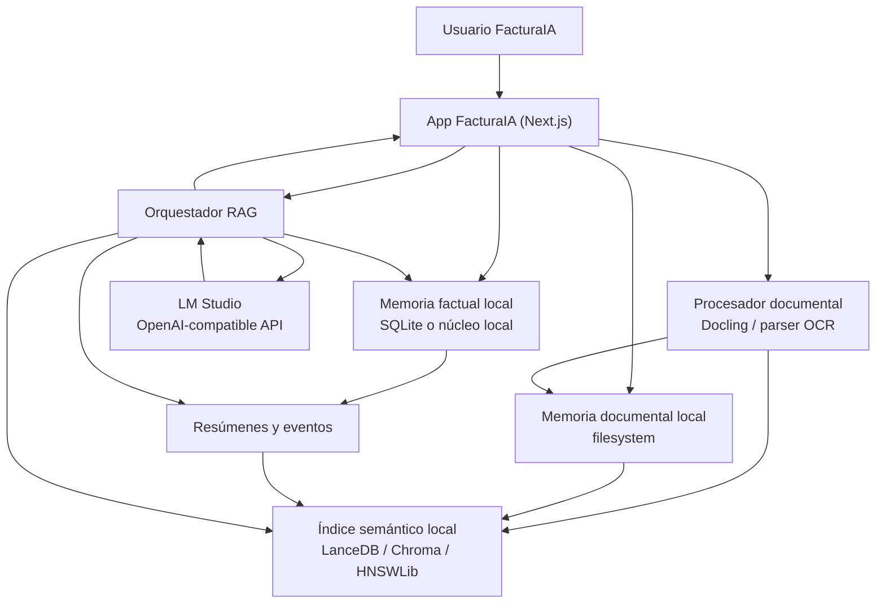

# Memoria local para LLM en FacturaIA

## Estado de este documento

Este documento describe la **arquitectura objetivo**, no algo completamente terminado.

A día de hoy ya existe una primera pieza real en `/estudio-ia`:

- ingesta local de notas, TXT, Markdown y PDF extraído
- recuperación por fragmentos
- respuestas con citas

Lo que **todavía no está implementado** aquí es la capa completa de memoria multi-año, embeddings persistentes y RAG local de varias capas que se describe más abajo.

## Objetivo

Definir una arquitectura de memoria local duradera para FacturaIA que permita:

- mantener contexto útil durante años
- funcionar en Windows y macOS sin depender de cloud
- aprovechar LM Studio como servidor local compatible con OpenAI
- separar claramente datos fiscales reales, documentos y memoria semántica
- evitar que el modelo "invente" memoria no trazable

Este documento es una guía de implementación para el programador. No describe algo ya terminado: describe la dirección recomendada para madurar FacturaIA.

## Principio base

La memoria de años **no debe vivir dentro del modelo**.

Debe vivir en capas locales externas:

1. memoria factual estructurada
2. memoria documental
3. memoria semántica para recuperación
4. memoria episódica de acciones y decisiones
5. memoria resumida por cliente, expediente y ejercicio

LM Studio debe usar esa memoria como contexto recuperado. No debe ser la fuente única de verdad.

## Qué problema resuelve

Con el núcleo actual, FacturaIA ya puede emitir facturas, seguir cobros y generar documentos. Lo que todavía no hace bien es:

- recordar durante años expedientes o incidencias por cliente
- responder preguntas cruzando varios ejercicios
- reutilizar el conocimiento extraído de PDFs, gastos, presupuestos o expedientes de renta
- justificar respuestas con citas o trazabilidad

Una capa de memoria local resuelve eso sin convertir FacturaIA en una infraestructura pesada.

## Requisitos no negociables

- funcionamiento local en el ordenador o servidor del cliente
- compatible con LM Studio en `http://localhost:1234/v1`
- sin obligación de terceros para el núcleo
- trazabilidad documental
- posibilidad de backup simple
- degradación elegante si el módulo no está activo

## Recomendación de arquitectura

### Capa 1. Memoria factual

Fuente de verdad estructurada.

Guardar aquí:

- clientes
- perfiles fiscales
- facturas
- cobros y recordatorios
- presupuestos y albaranes
- expedientes de renta
- fechas clave
- estados y notas operativas

Tecnología recomendada:

- `SQLite` si el modo local ya es el objetivo principal
- o ampliación del almacenamiento local actual en fichero, migrando después a SQLite

No usar el vector store como fuente de verdad para estos datos.

### Capa 2. Memoria documental

Guardar originales y derivados:

- PDFs de facturas
- justificantes de gasto
- documentos comerciales
- escritos o borradores de renta
- textos extraídos por OCR/parsing
- metadatos de procedencia

Tecnología recomendada:

- filesystem local bajo `FACTURAIA_DATA_DIR`
- estructura por `usuario / cliente / ejercicio / tipo`

Ejemplo:

```text
.facturaia-local/
  documents/
    <user-id>/
      clients/
        <client-id>/
          2026/
            invoices/
            expenses/
            tax/
            notes/
```

### Capa 3. Memoria semántica

Índice para recuperación por significado.

Tecnologías razonables:

- `LanceDB`
- `Chroma`
- `HNSWLib`

Recomendación pragmática:

- empezar con `LanceDB` o `HNSWLib`
- mantener el índice por usuario y opcionalmente por cliente/ejercicio

Guardar:

- `chunk_id`
- `document_id`
- `user_id`
- `client_id`
- `fiscal_year`
- `document_type`
- `source_path`
- `text_excerpt`
- `embedding`
- `created_at`
- `updated_at`

### Capa 4. Memoria episódica

Registro cronológico de hechos y decisiones.

Ejemplos:

- "el 14/03/2026 se envió recordatorio al cliente"
- "el 20/04/2026 el asesor marcó este gasto como no deducible"
- "el 02/05/2026 se corrigió el NIF del cliente"

Esto sirve para:

- explicar decisiones
- reconstruir expedientes
- alimentar resúmenes
- responder preguntas como "qué pasó con este cliente el año pasado"

### Capa 5. Memoria resumida

Resúmenes persistentes por:

- cliente
- ejercicio fiscal
- expediente de renta
- historial comercial

Tipos recomendados:

- resumen mensual
- resumen anual
- resumen del expediente
- resumen de incidencias abiertas

Estos resúmenes reducen coste y contexto al consultar al LLM.

## DFD recomendado



## Flujo de datos recomendado

### Ingesta documental

1. el usuario sube un PDF o imagen
2. FacturaIA guarda el original en memoria documental local
3. un parser local extrae texto, tablas y metadatos
4. el texto se divide en chunks
5. se generan embeddings
6. se indexa en el vector store
7. se guarda también un resumen corto y metadatos estructurados

### Consulta al asistente

1. el usuario pregunta
2. se detecta ámbito: cliente, ejercicio, tipo documental, expediente
3. se recuperan hechos estructurados relevantes
4. se recuperan chunks relevantes por similitud
5. se añaden resúmenes persistidos
6. se construye prompt con instrucciones + contexto + citas
7. LM Studio responde
8. la respuesta devuelve:
   - texto
   - fuentes citadas
   - confianza aproximada
   - advertencias si faltan datos

### Aprendizaje persistente

1. una acción importante genera evento episódico
2. un job local consolida eventos
3. se actualizan resúmenes por cliente y ejercicio
4. esos resúmenes se reutilizan en preguntas futuras

## Dónde usarlo en FacturaIA

### Módulo nuevo recomendado

- ruta nueva: `/estudio-ia`

Subsecciones:

- `Documentos`
- `Clientes`
- `Renta`
- `Búsqueda`
- `Memoria`

### Integraciones recomendadas

- `gastos`: subir justificantes y poder preguntar por gastos históricos
- `clientes`: resumen de relación por cliente
- `renta`: expediente por ejercicio y checklist con contexto documental
- `facturae`: recuperación de normativa o incidencias recurrentes
- `documents-ai`: reutilizar antecedentes comerciales y técnicos

## Qué usar con LM Studio

LM Studio ya ofrece:

- `POST /v1/responses`
- `POST /v1/chat/completions`
- `POST /v1/embeddings`

Usos recomendados:

- `responses` o `chat/completions` para razonamiento y redacción
- `embeddings` si el modelo cargado lo soporta

Si el modelo de LM Studio no ofrece embeddings estables, usar un modelo local separado solo para embeddings.

## Repos útiles para esta capa

### Para integrar rápido sin rehacer todo

- `AnythingLLM`
  - repo: [AnythingLLM](https://github.com/Mintplex-Labs/anything-llm)
  - útil como companion opcional
  - compatible con LM Studio
  - no lo usaría como núcleo de FacturaIA

- `Open Notebook`
  - repo: [Open Notebook](https://github.com/lfnovo/open-notebook)
  - útil como referencia directa para una experiencia tipo NotebookLM
  - compatible con LM Studio / OpenAI-compatible

### Para parsing documental

- `Docling`
  - repo: [Docling](https://github.com/DS4SD/docling)
  - recomendado como primera opción

### Para memoria "agéntica"

- `EverMemOS`
  - repo: [EverMemOS](https://github.com/EverMind-AI/EverMemOS)
  - interesante como investigación
  - no recomendado como núcleo de FacturaIA por complejidad y peso operativo

## Por qué no usar un sistema de memoria demasiado pesado

FacturaIA no necesita, de entrada:

- MongoDB
- Elasticsearch
- Redis
- Milvus
- pipelines multi-servicio complejos

Eso sube mucho la barrera de instalación en Windows y macOS.

La prioridad debe ser:

- instalación simple
- backup simple
- trazabilidad clara
- consultas útiles con contexto local

## Decisión recomendada

### Fase 1. Memoria útil y simple

- ampliar almacenamiento local
- crear estructura documental local
- añadir parsing con Docling
- guardar texto y metadatos

### Fase 2. RAG local

- añadir índice vectorial local
- crear `/estudio-ia`
- consulta con LM Studio + recuperación de fuentes

### Fase 3. Resúmenes persistentes

- resúmenes por cliente
- resúmenes por ejercicio
- línea temporal de decisiones

### Fase 4. Memoria avanzada

- reglas de consolidación
- priorización de eventos
- mejor ranking híbrido
- asistentes especializados por módulo

## Tablas / estructuras sugeridas

Si se usa SQLite:

### `memory_documents`

- `id`
- `user_id`
- `client_id`
- `fiscal_year`
- `document_type`
- `title`
- `source_path`
- `mime_type`
- `checksum`
- `status`
- `created_at`
- `updated_at`

### `memory_chunks`

- `id`
- `document_id`
- `chunk_index`
- `text`
- `token_count`
- `embedding_model`
- `created_at`

### `memory_events`

- `id`
- `user_id`
- `client_id`
- `event_type`
- `entity_type`
- `entity_id`
- `summary`
- `details_json`
- `created_at`

### `memory_summaries`

- `id`
- `user_id`
- `client_id`
- `fiscal_year`
- `summary_type`
- `content`
- `source_event_count`
- `updated_at`

## Reglas importantes

- nunca mezclar memoria factual con inferencias no verificadas
- toda respuesta sensible debe incluir fuentes
- toda memoria resumida debe poder regenerarse
- el vector store nunca debe reemplazar el documento original
- la memoria fiscal debe ser auditable

## Qué no debe hacer el asistente

- cerrar una renta automáticamente
- dar por deducible un gasto sin advertencia
- reescribir hechos estructurados sin confirmación
- actuar como firma digital o cumplimiento fiscal final

## Salida esperada para el programador

Este documento debería traducirse en:

1. un nuevo módulo `estudio-ia`
2. un subdirectorio de memoria local dentro de `FACTURAIA_DATA_DIR`
3. un parser documental local
4. un índice vectorial local
5. un orquestador RAG con LM Studio
6. un sistema de resúmenes persistentes por cliente y ejercicio

## Recomendación final

La mejor memoria de años para FacturaIA no es una "memoria mágica" del modelo.

Es una combinación de:

- hechos estructurados
- documentos locales
- resúmenes persistidos
- RAG local
- LM Studio como motor de razonamiento

Eso es suficientemente potente, mucho más instalable y bastante más realista que montar desde ya una infraestructura de memoria agéntica pesada.
