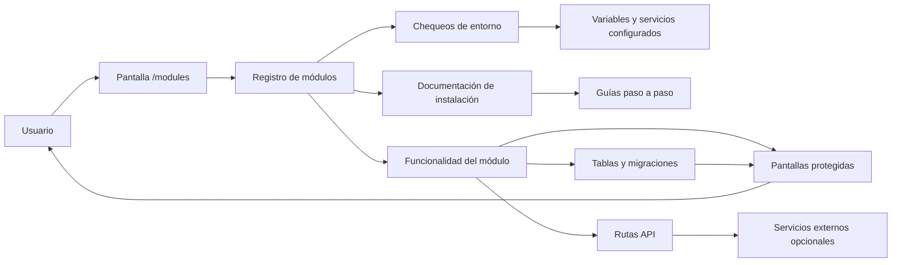

# DFD y plan de implementación de módulos

Este documento define cómo va a crecer FacturaIA como sistema modular self-hosted, qué módulos existen ya y en qué orden conviene implementar los siguientes.

## Objetivo

Evitar que FacturaIA se convierta en un bloque monolítico con funciones obligatorias para todos. Cada instalación debe poder activar solo las piezas que realmente aportan valor.

## Principios de diseño

- instalación privada y autogestionada
- activación gradual por necesidad real
- documentación clara por módulo
- requisitos visibles antes de instalar
- dependencias mínimas entre módulos
- compatibilidad con equipos personales y VPS pequeños

## DFD lógico

## Ciclo de vida de un módulo

1. Se define en el registro central.
2. Se documenta su instalación.
3. Se añaden chequeos de entorno.
4. Se habilita su pantalla o flujo funcional.
5. Se publica en `/modules`.
6. Se valida en demo y en build real.

## Estados de módulo

- `Activo`: ya usable dentro de la app.
- `Parcial`: funcionalidad presente, pero aún incompleta o dependiente de un único proveedor.
- `Siguiente`: próximo módulo que se implementará.
- `Planificado`: definido, pero aún sin desarrollo inmediato.

## Orden de implementación

0. Mensajería unificada
0. Backups locales
1. Backups remotos
2. Correo saliente
3. Correo entrante
4. Presupuestos y albaranes
5. OCR de gastos
6. CRM ligero
7. Firma documental
8. Conciliación bancaria
9. Facturae / VeriFactu

## Dependencias recomendadas

- Backups remotos depende del sistema de backups local.
- Correo entrante depende de tener antes correo saliente y modelo de cliente más maduro.
- Presupuestos y albaranes dependen del núcleo documental y de facturación.
- OCR de gastos depende de un modelo de gastos todavía no implementado.
- CRM ligero depende de mensajería, facturación y documentos.
- Firma documental depende de persistencia documental.
- Banca depende de modelo de cobros.
- Facturae / VeriFactu depende de la madurez del núcleo fiscal.

## Módulos ya presentes

- Mensajería unificada: WhatsApp Business y Telegram por webhook.
- Backups locales: exportación y restauración JSON.
- Backups remotos: primera entrega operativa con WebDAV / Nextcloud.
- Correo saliente: envío de facturas y correos de prueba con SMTP o Resend.
- Correo entrante: primera entrega operativa con importación IMAP manual.
- Presupuestos y albaranes: primera entrega operativa con persistencia, estados y conversión a factura.
- OCR de gastos: primera entrega operativa con extracción de texto y revisión asistida.

## Siguiente módulo

### CRM ligero

Motivo de prioridad:

- conecta facturas, mensajes, correo, gastos y documentos en torno al cliente
- aprovecha la base modular ya existente
- mejora mucho la operativa diaria sin exigir integraciones nuevas

## Documentación asociada

- `docs/modulos/README.md`
- `docs/modulos/MENSAJERIA_WHATSAPP_TELEGRAM.md`
- `docs/modulos/BACKUPS_REMOTOS.md`
- `docs/modulos/CORREO_SALIENTE.md`
- `docs/modulos/CORREO_ENTRANTE.md`
- `docs/modulos/PRESUPUESTOS_ALBARANES.md`
- `docs/modulos/GASTOS_OCR.md`
